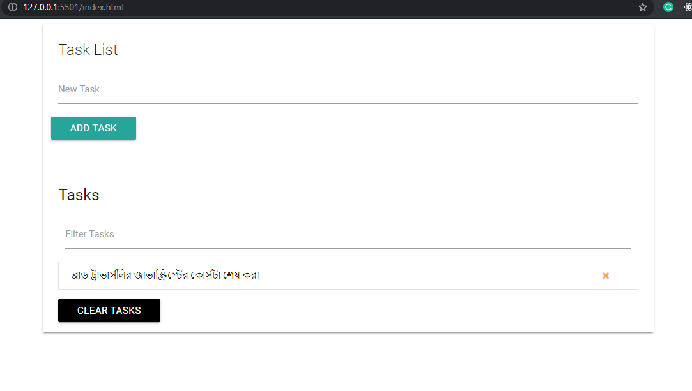

# Tasklist-Manager

This Task-list Manager is an application where we can add tasks, list them, delete them, search/ filter tasks and also persist them to the local storage so that they get saved, they don't just disapperar when we reload the page. 

This project is written with vanilla JavaScript using DOM manupulation methods.

